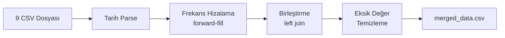
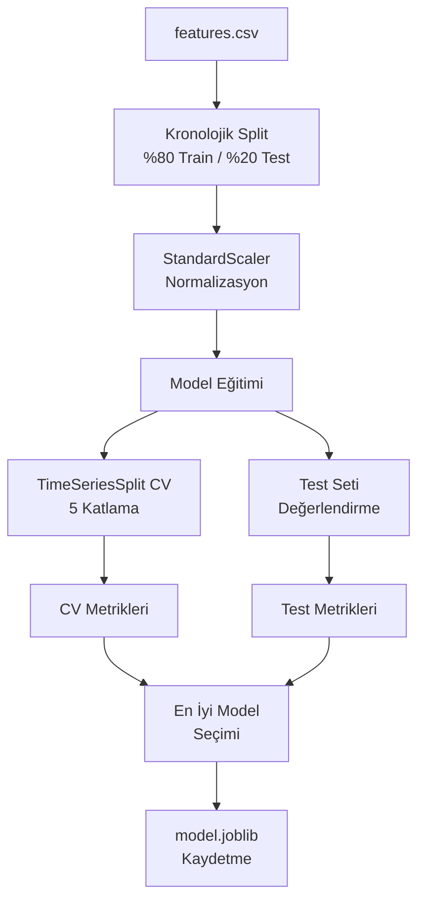

# 🏦 TCMB USD/TRY Döviz Kuru Tahmini — Makine Öğrenmesi Projesi

<p align="center">
  
  
  
  
</p>

> Türkiye Cumhuriyet Merkez Bankası (TCMB) verilerini kullanarak USD/TRY döviz kurunu makine öğrenmesi yöntemleriyle tahmin eden ve kur sıçramalarını tespit eden uçtan uca bir veri bilimi projesidir.

---

## 📋 İçindekiler

- [Proje Hakkında](#-proje-hakkında)
- [Proje Yapısı](#-proje-yapısı)
- [Veri Seti](#-veri-seti)
- [Özellik Mühendisliği](#-özellik-mühendisliği)
- [Modeller ve Sonuçlar](#-modeller-ve-sonuçlar)
- [Dashboard](#-dashboard)
- [Kurulum ve Çalıştırma](#-kurulum-ve-çalıştırma)
- [Görselleştirmeler](#-görselleştirmeler)
- [Teknik Detaylar](#-teknik-detaylar)
- [Sınırlılıklar ve Geliştirme Önerileri](#-sınırlılıklar-ve-geliştirme-önerileri)
- [Katkıda Bulunma](#-katkıda-bulunma)
- [Lisans](#-lisans)

---

## 🎯 Proje Hakkında

Bu proje, iki ana makine öğrenmesi görevini ele almaktadır:

| Görev | Açıklama | Hedef Değişken |
|-------|----------|----------------|
| **Regresyon** | Bir sonraki iş gününün USD/TRY kurunu tahmin etmek | `target_reg` (ertesi günün kuru) |
| **Sınıflandırma** | Ertesi gün kur sıçraması olup olmayacağını belirlemek | `target_cls` (\|değişim\| > %2.0 → 1) |

### Temel Özellikler

- ✅ **9 farklı TCMB veri kaynağı** (günlük, haftalık, aylık frekanslar)
- ✅ **Otomatik veri birleştirme** ve frekans hizalama (forward-fill)
- ✅ **Kapsamlı özellik mühendisliği** (lag, rolling, takvim, makroekonomik)
- ✅ **4 farklı model** — Ridge, RandomForest (regresyon + sınıflandırma)
- ✅ **Veri sızıntısı (leakage) önlemi** — `shift(1)` ile gelecek bilgisi engeli
- ✅ **TimeSeriesSplit cross-validation** (5 katlama)
- ✅ **Kronolojik train/test ayrımı** (%80/%20, shuffle yok)
- ✅ **İnteraktif Streamlit dashboard** ile sonuç görselleştirme
- ✅ **Otomatik Türkçe rapor ve 5 grafik** üretimi

---

## 📁 Proje Yapısı

```
machine-learning-3/
│
├── README.md                          # Bu dosya
│
├── dataset/                           # Ham veri dosyaları (Kaggle'dan)
│   ├── USD_TRY_CONVERSION_RATE.csv
│   ├── TL_INTEREST_RATE.csv
│   ├── USD_INTEREST_RATE.csv
│   ├── CPI_General_Index.csv
│   ├── Inflation_Expectation_12M.csv
│   ├── Repo_1Day_Weighted_Average_Rate.csv
│   ├── FX_Swap_Deposit_Amount.csv
│   ├── FX_TRANSACTION_VOLUME.csv
│   └── TCMB_Net_Funding.csv
│
├── tcmb-ml-proje/                     # 🧠 ML Pipeline
│   ├── README.md
│   ├── requirements.txt
│   ├── src/
│   │   ├── __init__.py
│   │   ├── utils.py                   # Sabitler ve yardımcı fonksiyonlar
│   │   ├── download_data.py           # Veri indirme (Kaggle / yerel kopyalama)
│   │   ├── preprocess.py              # Veri ön işleme ve birleştirme
│   │   ├── features.py                # Özellik mühendisliği
│   │   ├── train_regression.py        # Regresyon modeli eğitimi (Ridge + RF)
│   │   ├── train_classification.py    # Sınıflandırma modeli eğitimi (LR + RF)
│   │   └── evaluate.py                # Değerlendirme, grafikler, rapor
│   ├── data/
│   │   ├── raw/                       # Ham veri kopyaları
│   │   └── processed/                 # İşlenmiş veri (merged, features)
│   ├── models/                        # Eğitilmiş modeller (.joblib)
│   ├── reports/
│   │   ├── report.md                  # Otomatik üretilen Türkçe rapor
│   │   ├── metrics.json               # Birleşik metrikler
│   │   ├── figures/                   # 5 adet PNG grafik
│   │   ├── regression_results.json
│   │   ├── classification_results.json
│   │   ├── regression_predictions.csv
│   │   └── classification_predictions.csv
│   └── metrics/
│       └── metrics.json
│
└── tcmb-dashboard/                    # 📊 Streamlit Dashboard
    ├── README.md
    ├── requirements.txt
    ├── app.py                         # Ana dashboard uygulaması (6 sayfa)
    ├── utils.py                       # Dashboard yardımcı fonksiyonları
    └── assets/
```

---

## 📊 Veri Seti

Kaggle üzerindeki TCMB veri setinden alınan **9 farklı CSV dosyası** kullanılmıştır:

| Veri Kaynağı | Frekans | Değişken Adı | Açıklama |
|-------------|---------|--------------|----------|
| USD/TRY Döviz Kuru | Günlük | `Conversion_Rate` | **Ana hedef değişken** |
| FX Swap Mevduat Miktarı | Günlük | `FX_Swap_Deposit_Amount` | Döviz swap hacmi |
| FX İşlem Hacmi | Günlük | `FX_Transaction_Volume` | Döviz piyasa işlem hacmi |
| TCMB Net Fonlama | Günlük | `TCMB_Net_Funding` | Merkez bankası fonlama |
| TL Faiz Oranı (6 Ay) | Haftalık | `TRY_Interest_Rate_6Month` | TL mevduat faizi |
| USD Faiz Oranı | Haftalık | `USD_Interest_Rate` | USD mevduat faizi |
| TÜFE Genel Endeksi | Aylık | `CPI_Index` | Enflasyon göstergesi |
| Enflasyon Beklentisi (12 Ay) | Aylık | `Inflation_Expectation_12M` | Piyasa beklentisi |
| Repo Faiz Oranı (1 Gün Ağırlıklı) | Aylık | `Repo_1Day_Weighted_Average_Rate` | Para politikası aracı |

> **Not:** Farklı frekanstaki (haftalık/aylık) veriler **forward-fill** yöntemiyle günlük seriye hizalanmıştır.

---

## 🔧 Özellik Mühendisliği

Toplam **~20+ özellik** oluşturulmuştur:

| Kategori | Özellikler | Açıklama |
|----------|-----------|----------|
| **Gecikme (Lag)** | `lag_1`, `lag_2`, `lag_5`, `lag_10` | 1, 2, 5 ve 10 günlük gecikmeli kur değerleri |
| **Hareketli İstatistikler** | `rolling_mean_5`, `rolling_mean_20`, `rolling_std_5`, `rolling_std_20` | 5 ve 20 günlük ortalama ve standart sapma |
| **Takvim** | `haftanin_gunu`, `ay`, `ceyrek` | Zaman bileşenleri |
| **Yüzde Değişim** | `yuzde_degisim` | Günlük kur değişim oranı (%) |
| **Makroekonomik** | Faiz, enflasyon, repo, FX hacimleri | 9 CSV'den gelen tüm göstergeler |

> ⚠️ **Leakage Önlemi:** Tüm lag ve rolling hesaplamalarında `shift(1)` kullanılarak gelecek bilgisinin modele sızması engellenmiştir.

---

## 📈 Modeller ve Sonuçlar

### Regresyon — USD/TRY Bir Sonraki Gün Tahmini

| Model | MAE ↓ | RMSE ↓ | MAPE (%) ↓ | CV MAE |
|-------|-------|--------|------------|--------|
| Naive Baseline (yarın = bugün) | 0.0279 | 0.0403 | 0.07 | — |
| **⭐ Ridge Regression** | **0.0221** | **0.0287** | **0.05** | 0.1388 |
| RandomForest Regressor | 1.6470 | 1.8500 | 3.86 | 1.3461 |

> **En iyi regresyon modeli: Ridge** — Naive baseline'ı MAE'de %20.8 iyileştirmiştir.

### Sınıflandırma — Kur Sıçraması Tespiti (|değişim| > %2.0)

| Model | F1 ↑ | ROC-AUC ↑ | Precision ↑ | Recall ↑ | CV F1 |
|-------|------|-----------|-------------|----------|-------|
| Baseline (her zaman "sıçrama yok") | 0.000 | 0.000 | 0.000 | 0.000 | — |
| Logistic Regression | 0.286 | 0.918 | 0.800 | 0.174 | 0.430 |
| **⭐ RandomForest Classifier** | **0.920** | **0.977** | **0.852** | **1.000** | 0.472 |

> **En iyi sınıflandırma modeli: RandomForest** — F1=0.92, Recall=%100 ile tüm sıçramaları yakalayabilmektedir.

---

## 📊 Dashboard

Proje, sonuçları interaktif olarak görselleştirmek için **Streamlit** tabanlı profesyonel bir dashboard içermektedir.

### Dashboard Sayfaları

| Sayfa | İçerik |
|-------|--------|
| 🏠 **Genel Bakış** | Ana metrikler, model karşılaştırma tabloları, USD/TRY trend grafiği |
| 📊 **Veri İnceleme** | Veri tablosu, kolon tipleri, eksik değer analizi, interaktif zaman serisi |
| 📈 **Regresyon Sonuçları** | Tahmin vs Gerçek, hata dağılımı, model karşılaştırma |
| 🎯 **Sınıflandırma** | Confusion matrix, model metrikleri, karşılaştırma grafikleri |
| 📝 **Rapor** | Otomatik üretilen Türkçe rapor ve tüm grafikler |
| ⬇️ **İndir** | Tüm sonuçları (JSON, CSV, MD) indirme |

---

## 🚀 Kurulum ve Çalıştırma

### Gereksinimler

- Python 3.10+
- pip

### 1. Repoyu Klonlayın

```bash
git clone https://github.com/<kullanici_adi>/tcmb-ml-project.git
cd tcmb-ml-project
```

### 2. Bağımlılıkları Kurun

```bash
# ML Pipeline bağımlılıkları
pip install -r tcmb-ml-proje/requirements.txt

# Dashboard bağımlılıkları
pip install -r tcmb-dashboard/requirements.txt
```

### 3. ML Pipeline'ı Çalıştırın

```bash
cd tcmb-ml-proje

# Adım 1: Veriyi indir / kopyala
python -m src.download_data

# Adım 2: Veriyi ön işle ve birleştir
python -m src.preprocess

# Adım 3: Özellik mühendisliği
python -m src.features

# Adım 4: Regresyon modellerini eğit
python -m src.train_regression

# Adım 5: Sınıflandırma modellerini eğit
python -m src.train_classification

# Adım 6: Değerlendirme, grafikler ve rapor oluştur
python -m src.evaluate
```

### 4. Dashboard'u Başlatın

```bash
cd tcmb-dashboard
streamlit run app.py
```

Dashboard varsayılan olarak `http://localhost:8501` adresinde açılacaktır.

### Opsiyonel Parametreler

```bash
# Sıçrama eşiğini değiştir (varsayılan: %2.0)
python -m src.features --esik 1.5

# Veriyi yeniden indir
python -m src.download_data --force
```

---

## 📸 Görselleştirmeler

Pipeline otomatik olarak **5 adet grafik** üretmektedir:

| # | Grafik | Açıklama |
|---|--------|----------|
| 1 | **Zaman Serisi** | USD/TRY kurunun eğitim/test dönemi gösterimi |
| 2 | **Tahmin vs Gerçek** | Regresyon modellerinin test seti performansı |
| 3 | **Hata Dağılımı (Residual)** | Tahmin hatalarının histogramı |
| 4 | **Karmaşıklık Matrisi (Confusion Matrix)** | Sınıflandırma modelleri confusion matrix |
| 5 | **Özellik Önemi (Feature Importance)** | En etkili özellikler sıralaması |

Grafikler `tcmb-ml-proje/reports/figures/` klasöründe PNG formatında kaydedilir.

---

## 🔬 Teknik Detaylar

### Veri Ön İşleme Pipeline'ı



### Model Eğitim Süreci



### Kullanılan Teknolojiler

| Teknoloji | Versiyon | Kullanım |
|-----------|---------|----------|
| Python | 3.10+ | Ana programlama dili |
| pandas | ≥2.0 | Veri işleme |
| NumPy | ≥1.24 | Sayısal hesaplama |
| scikit-learn | ≥1.3 | Model eğitimi ve değerlendirme |
| matplotlib | ≥3.7 | Statik grafikler |
| seaborn | ≥0.12 | Gelişmiş görselleştirme |
| Streamlit | - | İnteraktif dashboard |
| Plotly | - | Dinamik grafikler (dashboard) |
| joblib | ≥1.3 | Model serileştirme |

---

## ⚠️ Sınırlılıklar ve Geliştirme Önerileri

### Mevcut Sınırlılıklar

1. **Veri boyutu:** ~500-700 iş günü sınırlı bir eğitim seti sunmaktadır
2. **Dış faktörler:** Siyasi olaylar, küresel piyasa şokları modele dahil değildir
3. **Frekans uyumsuzluğu:** Aylık/haftalık veriler forward-fill ile günlüğe çevrilmiş olup bilgi kaybı olabilir
4. **Hedef tanımı:** %2.0 sıçrama eşiği sübjektif olarak belirlenmiştir

### Gelecek Geliştirmeler

- 📈 Daha uzun zaman aralığı ile eğitim
- 🌍 Dışsal değişkenler (S&P 500, petrol fiyatı, VIX)
- 🤖 Gelişmiş modeller (XGBoost, LightGBM, LSTM)
- 🔍 Hiperparametre optimizasyonu (GridSearchCV / Optuna)
- 🧩 Ensemble yöntemler
- 📅 Olay bazlı özellikler (TCMB faiz kararı tarihleri)

---

## 🤝 Katkıda Bulunma

1. Bu repoyu **fork** edin
2. Yeni bir **branch** oluşturun (`git checkout -b feature/yeni-ozellik`)
3. Değişikliklerinizi **commit** edin (`git commit -m 'Yeni özellik eklendi'`)
4. Branch'inizi **push** edin (`git push origin feature/yeni-ozellik`)
5. Bir **Pull Request** açın

---

## 📄 Lisans

Bu proje MIT Lisansı altında lisanslanmıştır. Detaylar için [LICENSE](LICENSE) dosyasına bakınız.

---

<p align="center">
  <b>© 2026 — TCMB USD/TRY Makine Öğrenmesi Projesi</b><br>
  <sub>Makine Öğrenmesi Dersi Proje Ödevi</sub>
</p>
