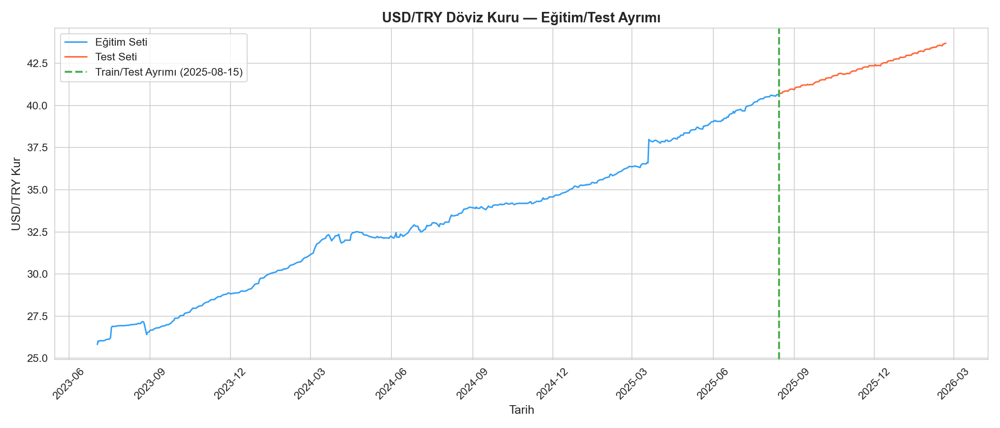
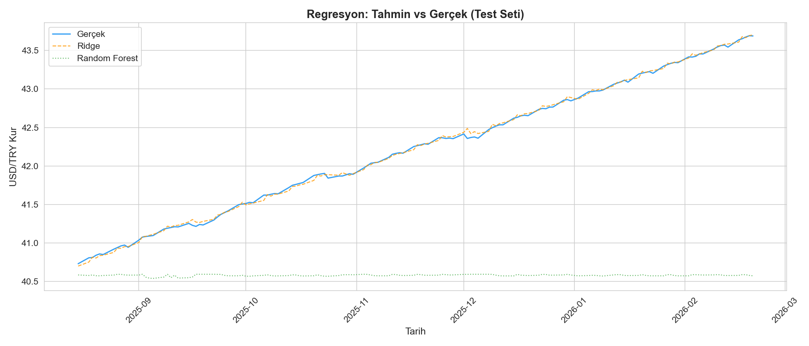
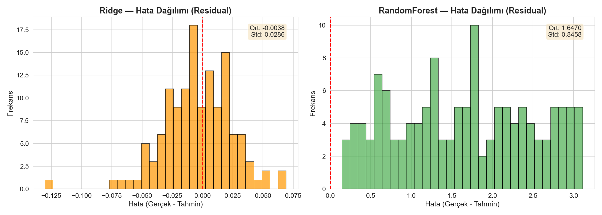
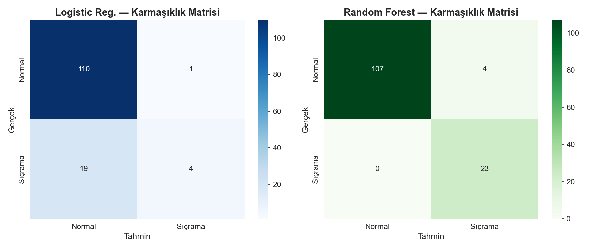
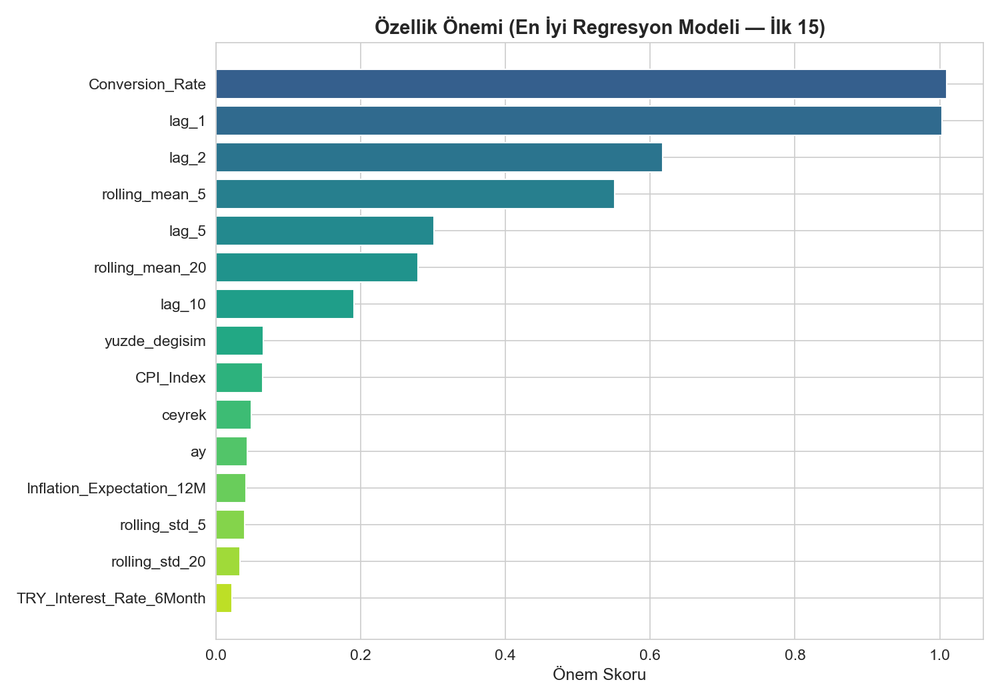

# TCMB USD/TRY Kur Tahmini — Makine Öğrenmesi Raporu

## 1. Proje Özeti

Bu proje, Türkiye Cumhuriyet Merkez Bankası (TCMB) verilerini kullanarak USD/TRY döviz kuru
tahmini yapmayı amaçlamaktadır. İki ana görev ele alınmıştır:

- **Regresyon:** Bir sonraki iş gününün USD/TRY kurunu tahmin etmek
- **Sınıflandırma:** Ertesi gün kur sıçraması olup olmayacağını belirlemek (|değişim| > %2.0)

## 2. Veri Seti

Kaggle'dan alınan veri seti 9 farklı CSV dosyasından oluşmaktadır:

| Veri | Frekans | Açıklama |
|------|---------|----------|
| USD/TRY Kuru | Günlük | Ana hedef değişken |
| TL Faiz Oranı (6 Ay) | Haftalık | TL mevduat faizi |
| USD Faiz Oranı | Haftalık | USD mevduat faizi |
| TÜFE Genel Endeksi | Aylık | Enflasyon göstergesi |
| Enflasyon Beklentisi (12 Ay) | Aylık | Piyasa beklentisi |
| Repo Faiz Oranı | Aylık | Para politikası aracı |
| FX Swap Mevduat | Günlük | Döviz swap hacmi |
| FX İşlem Hacmi | Günlük | Döviz piyasa hacmi |
| TCMB Net Fonlama | Günlük | Merkez bankası fonlama |

Farklı frekanstaki veriler forward-fill yöntemiyle günlük seriye dönüştürülmüştür.

## 3. Özellik Mühendisliği

Oluşturulan özellikler:

- **Gecikme (Lag) Özellikleri:** 1, 2, 5, 10 günlük gecikmeler
- **Hareketli İstatistikler:** 5 ve 20 günlük ortalama ve standart sapma
- **Takvim Özellikleri:** Haftanın günü, ay, çeyrek
- **Yüzde Değişim:** Günlük kur değişim oranı
- **Makroekonomik Göstergeler:** Faiz, enflasyon, repo, FX hacimleri

> **Leakage Önlemi:** Lag ve rolling hesaplamalarında `shift(1)` kullanılarak
> gelecek bilgisinin modele sızması engellenmiştir.

## 4. Modelleme Yaklaşımı

### Veri Bölünmesi
- **Kronolojik split:** %80 eğitim / %20 test (shuffle yok)
- **Cross-validation:** TimeSeriesSplit (5 katlama)

### Regresyon Modelleri

| Model | MAE | RMSE | MAPE (%) |
|-------|-----|------|----------|
| Naive_Baseline | 0.0279 | 0.0403 | 0.07 |
| Ridge | 0.0221 | 0.0287 | 0.05 |
| RandomForest_Reg | 1.6470 | 1.8500 | 3.86 |

**En iyi regresyon modeli:** Ridge

### Sınıflandırma Modelleri

| Model | F1 | ROC-AUC | Precision | Recall |
|-------|----|---------|-----------|---------|
| Baseline_0 | 0.0000 | 0.0000 | 0.0000 | 0.0000 |
| LogisticRegression | 0.2857 | 0.9177 | 0.8000 | 0.1739 |
| RandomForest_Cls | 0.9200 | 0.9773 | 0.8519 | 1.0000 |

**En iyi sınıflandırma modeli:** RandomForest_Cls

## 5. Görselleştirmeler

Aşağıdaki grafikler `reports/figures/` klasöründe mevcuttur:

1. **Zaman Serisi:** USD/TRY kurunun eğitim/test gösterimi
2. **Tahmin vs Gerçek:** Regresyon modellerinin test seti performansı
3. **Hata Dağılımı:** Residual histogramı
4. **Karmaşıklık Matrisi:** Sınıflandırma modelleri confusion matrix
5. **Özellik Önemi:** En etkili özellikler

## 6. Sonuç ve Yorum

### Regresyon
- Naive baseline (yarın = bugün) güçlü bir baseline'dır çünkü döviz kurları genellikle
  güçlü otokorelasyon gösterir.
- Makine öğrenmesi modelleri lag ve rolling özellikleriyle bu baseline'ı iyileştirmeyi
  amaçlamaktadır.

### Sınıflandırma
- Kur sıçramaları nadir olaylar olduğundan sınıf dengesizliği mevcuttur.
- `class_weight="balanced"` parametresi ile dengesizlik ele alınmıştır.

## 7. Sınırlılıklar

1. **Veri boyutu:** ~500-700 iş günü sınırlı bir eğitim seti sunmaktadır
2. **Dış faktörler:** Siyasi olaylar, küresel piyasa şokları modele dahil değildir
3. **Frekans uyumsuzluğu:** Aylık/haftalık veriler forward-fill ile günlüğe çevrilmiş
   olup bilgi kaybı olabilir
4. **Hedef tanımı:** %2.0 sıçrama eşiği sübjektiven belirlenmiştir

## 8. Geliştirme Önerileri

1. **Daha fazla veri:** Daha uzun zaman aralığı ile eğitim
2. **Dışsal değişkenler:** S&P 500, petrol fiyatı, VIX gibi küresel göstergeler
3. **Gelişmiş modeller:** XGBoost, LightGBM veya LSTM gibi derin öğrenme modelleri
4. **Hiperparametre optimizasyonu:** GridSearchCV veya Optuna ile sistematik arama
5. **Ensemble yöntemler:** Birden fazla modelin tahminlerini birleştirme
6. **Olay bazlı özellikler:** TCMB faiz kararı tarihleri gibi kategorik değişkenler
